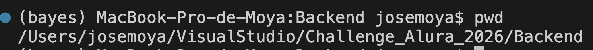
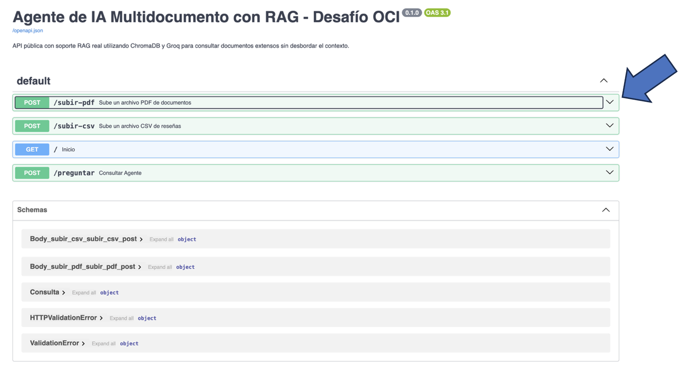
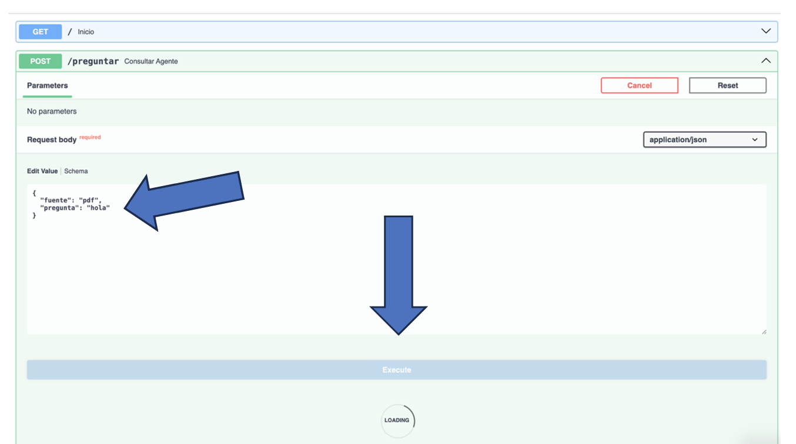
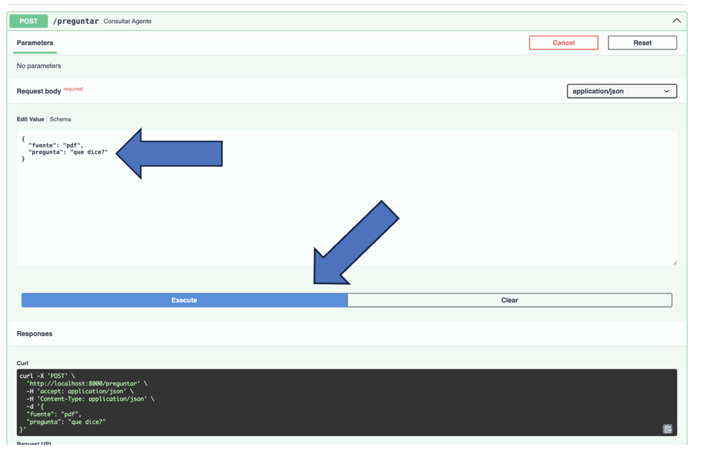

# 🤖 Agente de IA para Consulta Inteligente de Documentos

## 📖 Descripción del proyecto

Imaginemos el siguiente escenario:

Una empresa (ya sea una fintech, una consultora o una startup) cuenta con una gran cantidad de documentos internos, como:

- Manuales
- Informes
- Políticas
- Hojas de cálculo

El problema es que las personas colaboradoras invierten mucho tiempo buscando información dentro de estos documentos.

### Objetivo

Desarrollar un **agente de Inteligencia Artificial** que permita realizar preguntas en lenguaje natural y obtener respuestas precisas sin necesidad de abrir o revisar manualmente los documentos.

---

# 🚀 Etapas del proyecto

## 1. Procesamiento de documentos

El primer paso consiste en seleccionar un documento (PDF o CSV) y procesarlos para que la aplicación pueda comprender su contenido.

Los documentos pueden contener información como:

- 📄 Políticas internas de la empresa.
- 📊 Datos de ventas.
- 💻 Documentación técnica.
- 📚 Manuales de usuario.
- 📈 Reportes internos.

> **Nota:** Se proporciona un documento de ejemplo, pero cada participante puede utilizar cualquier documento que desee para personalizar su agente.

---

## 2. Construcción del agente de IA

Una vez procesado el documento, el siguiente paso consiste en crear un agente capaz de responder preguntas sobre su contenido.

### Ejemplos de consultas

**Pregunta**

> ¿Cuál fue el producto más vendido en diciembre de 2015?

**Pregunta**

> ¿Qué lenguajes de programación utiliza el backend de la plataforma?

El agente deberá localizar la información dentro del documento y responder de manera clara y precisa.

---

## 3. Despliegue en Oracle Cloud (OCI)

Finalmente, el agente deberá publicarse en la nube utilizando **Oracle Cloud Infrastructure (OCI)**.

El objetivo es que la aplicación deje de ejecutarse únicamente en el equipo local y quede disponible públicamente.

---

# 🛠 Tecnologías sugeridas

Las siguientes tecnologías son únicamente una recomendación.

Puedes utilizar cualquier herramienta que se adapte mejor a tu solución.

|        Tecnología        |          Uso            |
|--------------------------|-------------------------|
| Python                   | Desarrollo del proyecto |
| LangChain                | Construcción del agente |
| PyPDF                    | Lectura de archivos PDF |
| Pandas                   | Lectura de archivos CSV |
| ChatGPT / Gemma / Cohere | Modelo de lenguaje      |
| OCI Compute              | Despliegue en la nube   |

> **Importante:** Estas herramientas son sugerencias, no requisitos obligatorios.

---

# 📦 Entregables

El proyecto deberá publicarse en un repositorio de GitHub que incluya:

- Un repositorio organizado.
- Historial de commits.
- Archivo **README.md**, con:
   - Una descripción de la arquitectura que montamos.
   - Ejemplos de preguntas y respuestas que el agente puede resolver.
   - Instrucciones para quien quiera ejecutar el proyecto.
   - Un enlace o una captura de pantalla de la aplicación corriendo en OCI,
     para comprobar que el deploy (implementación) realmente funcionó.

---

# 📄 Contenido mínimo del README

El README deberá incluir:

## 1. Descripción de la arquitectura

Explicar cómo está construida la solución.

# 🧠 Arquitectura RAG (Retrieval-Augmented Generation)

Este proyecto implementa la arquitectura **RAG (Retrieval-Augmented Generation)**, una técnica que permite complementar el conocimiento de un Modelo de Lenguaje (LLM) con información proveniente de documentos privados, logrando respuestas precisas y basadas en datos reales.

El flujo de funcionamiento del sistema se divide en tres etapas principales.

---

## 1. 📥 Fase de Ingesta (Preparación del conocimiento)

Un Modelo de Lenguaje como **Llama 3** no conoce el contenido de documentos privados de una empresa. Por ello, antes de responder preguntas, el sistema debe procesar e indexar la información.

Esta etapa se ejecuta mediante los endpoints **`/subir-pdf`** y **`/subir-csv`**, e incluye los siguientes procesos:

### Extracción del contenido

El sistema obtiene el texto del documento utilizando funciones especializadas:

* `preparar_pdf_subido_para_llm()` para documentos PDF.
* `preparar_reviews_csv_subido_para_llm()` para archivos CSV.

---

### Fragmentación (Chunking)

Posteriormente, el contenido se divide en pequeños fragmentos utilizando:

```python
RecursiveCharacterTextSplitter
```

La fragmentación es una parte fundamental de la arquitectura RAG, ya que los Modelos de Lenguaje poseen un límite en la cantidad de información que pueden procesar simultáneamente.

En este proyecto cada fragmento contiene aproximadamente **700 caracteres**, con un solapamiento de **100 caracteres**, lo que permite conservar el contexto entre fragmentos consecutivos.

---

### Vectorización y almacenamiento

Cada fragmento se transforma en un **embedding** mediante el modelo:

```
all-MiniLM-L6-v2
```

Los embeddings representan matemáticamente el significado semántico del texto y posteriormente son almacenados en una base de datos vectorial utilizando **ChromaDB**.

De esta manera, el conocimiento queda preparado para realizar búsquedas semánticas de alta velocidad.

---

# 🔎 2. Fase de Recuperación (Retrieval)

Cuando el usuario realiza una consulta mediante el endpoint **`/preguntar`**, el sistema no envía el documento completo al modelo de IA.

En su lugar, realiza una búsqueda semántica sobre la base vectorial mediante:

```python
coleccion_activa.query(...)
```

Durante este proceso:

* La pregunta del usuario se convierte automáticamente en un embedding.
* ChromaDB compara dicho embedding con todos los fragmentos almacenados.
* Se recuperan únicamente los fragmentos cuyo significado sea más similar a la pregunta.

En esta implementación se recuperan hasta **15 fragmentos relevantes**, reduciendo significativamente la cantidad de información enviada al modelo y mejorando tanto la velocidad como la precisión de las respuestas.

---

# 🤖 3. Fase de Aumento y Generación (Augmentation & Generation)

Una vez recuperados los fragmentos más relevantes, el sistema construye un contexto enriquecido que será enviado al Modelo de Lenguaje.

Este proceso se realiza mediante la variable:

```python
contenido_completo
```

Su estructura es similar a la siguiente:

```text
Contexto recuperado del documento

[Fragmentos encontrados por ChromaDB]

Pregunta del usuario
```

Finalmente, este contexto es enviado al modelo **Llama 3.1 8B Instant** ejecutado mediante la API de **Groq**.

El Modelo de Lenguaje genera la respuesta utilizando exclusivamente la información recuperada desde la base vectorial, evitando inventar información que no exista en los documentos proporcionados.

---

# 🤖 ¿Por qué este proyecto también es un Agente de IA?

Aunque el sistema utiliza la arquitectura RAG, también puede considerarse un **Agente de Inteligencia Artificial**, ya que posee capacidades adicionales que van más allá de una simple conversación con un LLM.

## 1. Tiene un objetivo claramente definido

Mediante el **System Prompt**, el modelo recibe una identidad y un conjunto de reglas que delimitan su comportamiento.

Por ejemplo:

> "Eres un asistente experto en comprensión lectora. Responde utilizando estrictamente los fragmentos del documento recuperado."

Esto evita respuestas fuera del contexto del documento y mejora la confiabilidad de la información generada.

---

## 2. Utiliza herramientas externas

El agente no depende únicamente del conocimiento interno del Modelo de Lenguaje.

Puede interactuar con diferentes herramientas implementadas en la aplicación, tales como:

* ChromaDB para realizar búsquedas semánticas.
* Procesadores especializados para archivos PDF y CSV.
* Modelos de embeddings para transformar texto en vectores.
* Selección automática de la base de conocimiento según el tipo de documento consultado.

Estas herramientas amplían considerablemente sus capacidades.

---

## 3. Toma decisiones de manera autónoma

Antes de responder una pregunta, el sistema valida el estado de la aplicación.

Por ejemplo:

* Verifica si existe un documento previamente indexado.
* Determina si la consulta corresponde a un PDF o a un CSV.
* Impide consultas cuando no existe una base de conocimiento cargada.
* Devuelve mensajes de error descriptivos (`HTTP 400`) cuando el usuario intenta realizar una operación inválida.

Estas decisiones permiten proteger la API y garantizar un funcionamiento consistente.

---

# 📌 Resumen del flujo RAG

```text
Usuario
      │
      ▼
Sube un PDF o CSV
      │
      ▼
Extracción del contenido
      │
      ▼
Fragmentación (Chunks)
      │
      ▼
Embeddings
      │
      ▼
ChromaDB (Base Vectorial)
      │
      ▼
Pregunta del usuario
      │
      ▼
Búsqueda semántica
      │
      ▼
Recuperación de fragmentos relevantes
      │
      ▼
Construcción del contexto
      │
      ▼
Groq + Llama 3.1
      │
      ▼
Respuesta en lenguaje natural
```

Esta arquitectura permite que el agente responda preguntas sobre documentos privados de manera rápida, precisa y fundamentada, combinando las capacidades de búsqueda semántica de **ChromaDB** con el poder de generación de lenguaje de **Llama 3.1**, implementando una solución moderna basada en **Retrieval-Augmented Generation (RAG)**.


---

## 2. Ejemplos de uso

Mostrar preguntas que el agente puede responder.

**Ejemplo**

```
Pregunta:
¿Cuál fue el producto más vendido en diciembre de 2015?

Respuesta:
El producto más vendido fue...
```

---

## 3. Instrucciones de ejecución y Evidencia del funcionamiento del proyecto:

### Intrucciones para ejecutar el ***Backend (Fastapi)***


Pasos para ejecutar el backend localmente: 

**Nota importante:** Debes estar en la ruta de ubicación donde se encuentra tú archivo de trabajo con el que usas fastapi, en mi caso la ruta de trabajo indica que me encuentro en la carpeta Backend, y es donde se encuentra **mi_proyecto.py**:

<p align="center">
    
</p>

**Observa** que tú archivo en este caso **mi_proyecto.py**, no debe ir la extensión del .py para ejecutarlo, en esta ocasión 
**Solo Ejecuta el siguiente comando en la terminal**:

```bash
uvicorn mi_proyecto:app --reload
```
Una vez hecho esto en tú terminal verás esto al final:

<p align="center">
    
</p>

Esto quiere decir que todo marcha bien, y es momento de abrirlo en tú navegador,
copia esta direccion y pegala en el navegador de tú confianza:

```
http://localhost:8000/docs
```

Encontrarás una interfaz interactiva donde puedes:

- Probar todos los endpoints. 
- Enviar archivos. 
- Hacer preguntas. 
- Ver las respuestas. 
- Consultar los modelos de datos.

La interfaz saldrá como se muestra en la imagen de abajo y los botones a usar son los que estan en un **recuadro verde y dicen POST**, 
le das clip a la pestaña donde esta marcada con una flecha azul para desplegar la información a usar:

<p align="center">
    
</p>

Una vez dandole clic a la pestaña selecionada; Se desplegará un boton que dira **Try it out**, y a su vez se desplegará otro menú.

<p align="center">
    
</p>

Una vez dándole clic a el boton de **Try it out**; Puedes observar como cambio la interfaz, perimitiendote subir tú archivo pdf (el que tú desees), dándole clic en la barra que dice **seleccionar archivo** y posteriormente al **boton tipo barra en azul que dice Execute** para que se ejecute el proceso (las flechas azules grandes indican la posición de los botones a presionar).

<p align="center">
    
</p>

Una vez subido nuestro archvio pdf y haciendo clic a el boton **Execute**, cambiará otra vez ligeramente la interfaz, y puedes observar que manda un mensaje al final, el cual es: El nombre del archivo pdf que subiste y encuantos fragmentos partio la información para subirla a nuestra base vectorial que se usará para que el agente te de una respuesta a tú pregunta lo más acertada posible.

<p align="center">
    
</p>

## ¡En este punto estamos listo para pasarnos al POST preguntar!

<p align="center">
    
</p>

Una vez haciendo clic a el boton de **Try It out**; Puedes observar otro cambio en la interfaz; Perimitiendote cambiar la pregunta de **hola** que se colocó anteriormente, por lo que tú quieras o lo que sea que le quieras preguntar al agente, o preguntas referentes al contenido de tú archivo y posteriormente le das clic al boton que dice **Execute**.

<p align="center">
    
</p>

Notarás que; La pregunta que se hizo **(hola)** y la fuente usada **(archivo pdf)** son las que se usarán para que el modelo de te una respuesta; Más abajo hay otro recuadro que muestra la respuesta y los fragmetos o contexto que uso el agente del archivo pdf para poder darte una respuesta lo más precisa posible.

<p align="center">
    
</p>

Para realizar otra pregunta, regresas al **POST preguntar** y cambias la pregunta por otra que desees hacer, y posteriormente le das clic al **boton Execute**.

<p align="center">
    
</p>

Nuestro agente te dará otra respuesta, lo más acertdo posible.

<p align="center">
    
</p>

## Saliendo de la interfaz 

Para salir de la interfaz de Fastapi, en la página web abierta solo la cerramos como cualquier otra página. Y en nuestra terminal, **das clip en la terminal** y colocas el siguiente comando **ctrl + C** para que ejecute la finalización del proceso abierto en la terminal, y deberá salirte algo parecido como se muestra en la imagen:

<p align="center">
    
</p>

---

## 4. Evidencia del despliegue

Agregar alguno de los siguientes elementos:

- Enlace público de la aplicación.
- Captura de pantalla.
- URL del despliegue en OCI.

Esto servirá para demostrar que el proyecto fue desplegado correctamente.

Se ve mucho más profesional.

---


La interfaz de Swagger permite probar todos los endpoints de la API.

## 📸 Paso 1 — Abrir la documentación

Ejecuta:

```bash
uvicorn archivo_reto_principal:app --reload
```

```text
http://localhost:8000/docs
```


La interfaz de Swagger permite probar todos los endpoints de la API.
