# 🤖 Agente de IA para Consulta Inteligente de Documentos

## 📖 Descripción del proyecto

Imaginemos el siguiente escenario:

Una empresa (ya sea una fintech, una consultora o una startup) cuenta con una gran cantidad de documentos internos, como:

- Manuales
- Informes
- Políticas
- Hojas de cálculo

El problema es que las personas colaboradoras invierten mucho tiempo buscando información dentro de estos documentos.

### Objetivo

Desarrollar un **agente de Inteligencia Artificial** que permita realizar preguntas en lenguaje natural y obtener respuestas precisas sin necesidad de abrir o revisar manualmente los documentos.

---

# 🚀 Etapas del proyecto

## 1. Procesamiento de documentos

El primer paso consiste en seleccionar un documento (PDF o CSV) y procesarlos para que la aplicación pueda comprender su contenido.

Los documentos pueden contener información como:

- 📄 Políticas internas de la empresa.
- 📊 Datos de ventas.
- 💻 Documentación técnica.
- 📚 Manuales de usuario.
- 📈 Reportes internos.

> **Nota:** Se proporciona un documento de ejemplo, pero cada participante puede utilizar cualquier documento que desee para personalizar su agente.

---

## 2. Construcción del agente de IA

Una vez procesado el documento, el siguiente paso consiste en crear un agente capaz de responder preguntas sobre su contenido.

### Ejemplos de consultas

**Pregunta**

> ¿Cuál fue el producto más vendido en diciembre de 2015?

**Pregunta**

> ¿Qué lenguajes de programación utiliza el backend de la plataforma?

El agente deberá localizar la información dentro del documento y responder de manera clara y precisa.

---

## 3. Despliegue en Oracle Cloud (OCI)

Finalmente, el agente deberá publicarse en la nube utilizando **Oracle Cloud Infrastructure (OCI)**.

El objetivo es que la aplicación deje de ejecutarse únicamente en el equipo local y quede disponible públicamente.

---

# 🛠 Tecnologías sugeridas

Las siguientes tecnologías son únicamente una recomendación.

Puedes utilizar cualquier herramienta que se adapte mejor a tu solución.

|        Tecnología        |          Uso            |
|--------------------------|-------------------------|
| Python                   | Desarrollo del proyecto |
| LangChain                | Construcción del agente |
| PyPDF                    | Lectura de archivos PDF |
| Pandas                   | Lectura de archivos CSV |
| ChatGPT / Gemma / Cohere | Modelo de lenguaje      |
| OCI Compute              | Despliegue en la nube   |

> **Importante:** Estas herramientas son sugerencias, no requisitos obligatorios.

---

# 📦 Entregables

El proyecto deberá publicarse en un repositorio de GitHub que incluya:

- Un repositorio organizado.
- Historial de commits.
- Archivo **README.md**, con:
   - Una descripción de la arquitectura que montamos.
   - Ejemplos de preguntas y respuestas que el agente puede resolver.
   - Instrucciones para quien quiera ejecutar el proyecto.
   - Un enlace o una captura de pantalla de la aplicación corriendo en OCI,
     para comprobar que el deploy (implementación) realmente funcionó.

---

# 📄 Contenido mínimo del README

El README deberá incluir:

## 1. Descripción de la arquitectura

Explicar cómo está construida la solución.

# 🧠 Arquitectura RAG (Retrieval-Augmented Generation)

Este proyecto implementa la arquitectura **RAG (Retrieval-Augmented Generation)**, una técnica que permite complementar el conocimiento de un Modelo de Lenguaje (LLM) con información proveniente de documentos privados, logrando respuestas precisas y basadas en datos reales.

El flujo de funcionamiento del sistema se divide en tres etapas principales.

---

## 1. 📥 Fase de Ingesta (Preparación del conocimiento)

Un Modelo de Lenguaje como **Llama 3** no conoce el contenido de documentos privados de una empresa. Por ello, antes de responder preguntas, el sistema debe procesar e indexar la información.

Esta etapa se ejecuta mediante los endpoints **`/subir-pdf`** y **`/subir-csv`**, e incluye los siguientes procesos:

### Extracción del contenido

El sistema obtiene el texto del documento utilizando funciones especializadas:

* `preparar_pdf_subido_para_llm()` para documentos PDF.
* `preparar_reviews_csv_subido_para_llm()` para archivos CSV.

---

### Fragmentación (Chunking)

Posteriormente, el contenido se divide en pequeños fragmentos utilizando:

```python
RecursiveCharacterTextSplitter
```

La fragmentación es una parte fundamental de la arquitectura RAG, ya que los Modelos de Lenguaje poseen un límite en la cantidad de información que pueden procesar simultáneamente.

En este proyecto cada fragmento contiene aproximadamente **700 caracteres**, con un solapamiento de **100 caracteres**, lo que permite conservar el contexto entre fragmentos consecutivos.

---

### Vectorización y almacenamiento

Cada fragmento se transforma en un **embedding** mediante el modelo:

```
all-MiniLM-L6-v2
```

Los embeddings representan matemáticamente el significado semántico del texto y posteriormente son almacenados en una base de datos vectorial utilizando **ChromaDB**.

De esta manera, el conocimiento queda preparado para realizar búsquedas semánticas de alta velocidad.

---

# 🔎 2. Fase de Recuperación (Retrieval)

Cuando el usuario realiza una consulta mediante el endpoint **`/preguntar`**, el sistema no envía el documento completo al modelo de IA.

En su lugar, realiza una búsqueda semántica sobre la base vectorial mediante:

```python
coleccion_activa.query(...)
```

Durante este proceso:

* La pregunta del usuario se convierte automáticamente en un embedding.
* ChromaDB compara dicho embedding con todos los fragmentos almacenados.
* Se recuperan únicamente los fragmentos cuyo significado sea más similar a la pregunta.

En esta implementación se recuperan hasta **15 fragmentos relevantes**, reduciendo significativamente la cantidad de información enviada al modelo y mejorando tanto la velocidad como la precisión de las respuestas.

---

# 🤖 3. Fase de Aumento y Generación (Augmentation & Generation)

Una vez recuperados los fragmentos más relevantes, el sistema construye un contexto enriquecido que será enviado al Modelo de Lenguaje.

Este proceso se realiza mediante la variable:

```python
contenido_completo
```

Su estructura es similar a la siguiente:

```text
Contexto recuperado del documento

[Fragmentos encontrados por ChromaDB]

Pregunta del usuario
```

Finalmente, este contexto es enviado al modelo **Llama 3.1 8B Instant** ejecutado mediante la API de **Groq**.

El Modelo de Lenguaje genera la respuesta utilizando exclusivamente la información recuperada desde la base vectorial, evitando inventar información que no exista en los documentos proporcionados.

---

# 🤖 ¿Por qué este proyecto también es un Agente de IA?

Aunque el sistema utiliza la arquitectura RAG, también puede considerarse un **Agente de Inteligencia Artificial**, ya que posee capacidades adicionales que van más allá de una simple conversación con un LLM.

## 1. Tiene un objetivo claramente definido

Mediante el **System Prompt**, el modelo recibe una identidad y un conjunto de reglas que delimitan su comportamiento.

Por ejemplo:

> "Eres un asistente experto en comprensión lectora. Responde utilizando estrictamente los fragmentos del documento recuperado."

Esto evita respuestas fuera del contexto del documento y mejora la confiabilidad de la información generada.

---

## 2. Utiliza herramientas externas

El agente no depende únicamente del conocimiento interno del Modelo de Lenguaje.

Puede interactuar con diferentes herramientas implementadas en la aplicación, tales como:

* ChromaDB para realizar búsquedas semánticas.
* Procesadores especializados para archivos PDF y CSV.
* Modelos de embeddings para transformar texto en vectores.
* Selección automática de la base de conocimiento según el tipo de documento consultado.

Estas herramientas amplían considerablemente sus capacidades.

---

## 3. Toma decisiones de manera autónoma

Antes de responder una pregunta, el sistema valida el estado de la aplicación.

Por ejemplo:

* Verifica si existe un documento previamente indexado.
* Determina si la consulta corresponde a un PDF o a un CSV.
* Impide consultas cuando no existe una base de conocimiento cargada.
* Devuelve mensajes de error descriptivos (`HTTP 400`) cuando el usuario intenta realizar una operación inválida.

Estas decisiones permiten proteger la API y garantizar un funcionamiento consistente.

---

# 📌 DIAGRAMA DE FLUJO DEL PROYECTO AGENTE_RAG

   <p align="center">
    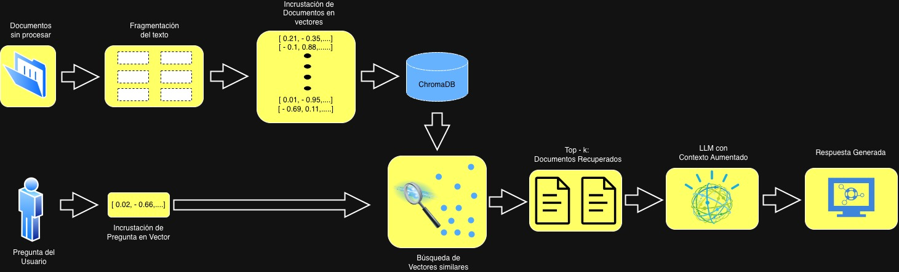
   </p>


Esta arquitectura permite que el agente responda preguntas sobre documentos privados de manera rápida, precisa y fundamentada, combinando las capacidades de búsqueda semántica de **ChromaDB** con el poder de generación de lenguaje de **Llama 3.1**, implementando una solución moderna basada en **Retrieval-Augmented Generation (RAG)**.


---

## 2. Ejemplos de uso

Mostrar preguntas que el agente puede responder.

**Ejemplo**

```
Pregunta:
¿Cuál fue el producto más vendido en diciembre de 2015?

Respuesta:
El producto más vendido fue...
```

---

## 3. Instrucciones de ejecución y Evidencia del funcionamiento del proyecto:

### Intrucciones para ejecutar el ***Backend (Fastapi)***


Pasos para ejecutar el backend localmente: 

**Nota importante:** Debes estar en la ruta de ubicación donde se encuentra tú archivo de trabajo con el que usas fastapi, en mi caso la ruta de trabajo indica que me encuentro en la carpeta Backend, y es donde se encuentra **mi_proyecto.py**:

<p align="center">
    
</p>

**Observa** que tú archivo en este caso **mi_proyecto.py**, no debe ir la extensión del .py para ejecutarlo, en esta ocasión 
**Solo Ejecuta el siguiente comando en la terminal**:

```bash
uvicorn mi_proyecto:app --reload
```
Una vez hecho esto en tú terminal verás esto al final:

<p align="center">
    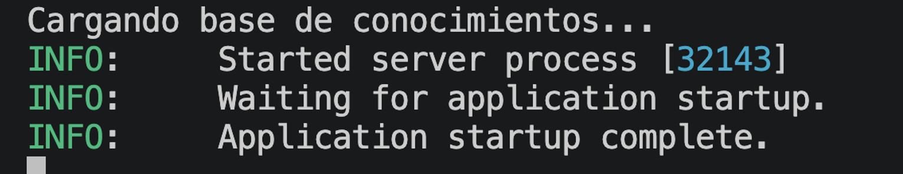
</p>

Esto quiere decir que todo marcha bien, y es momento de abrirlo en tú navegador,
copia esta direccion y pegala en el navegador de tú confianza:

```
http://localhost:8000/docs
```

Encontrarás una interfaz interactiva donde puedes:

- Probar todos los endpoints. 
- Enviar archivos. 
- Hacer preguntas. 
- Ver las respuestas. 
- Consultar los modelos de datos.

La interfaz saldrá como se muestra en la imagen de abajo y los botones a usar son los que estan en un **recuadro verde y dicen POST**, 
le das clip a la pestaña donde esta marcada con una flecha azul para desplegar la información a usar:

<p align="center">
    
</p>

Una vez dandole clic a la pestaña selecionada; Se desplegará un boton que dira **Try it out**, y a su vez se desplegará otro menú.

<p align="center">
    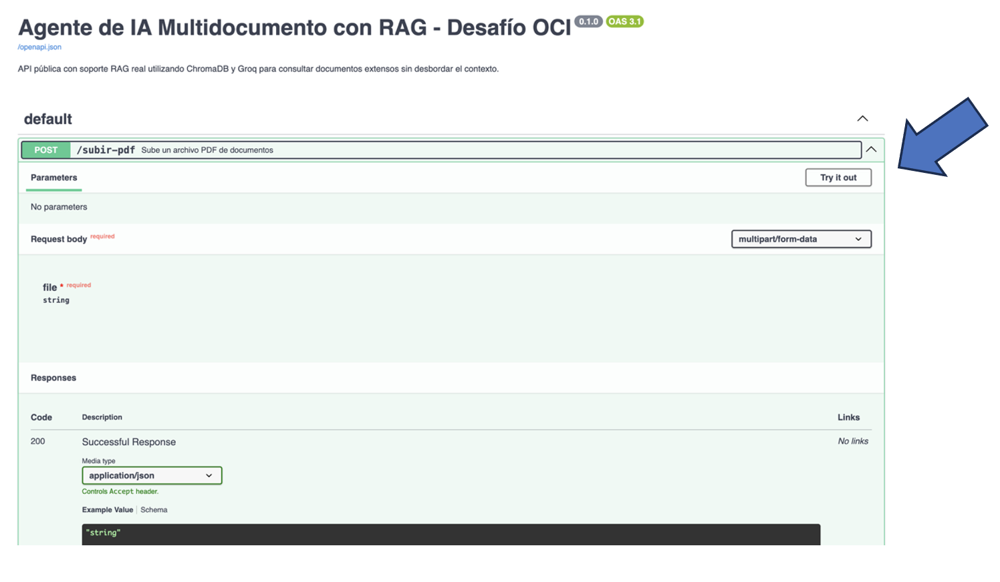
</p>

Una vez dándole clic a el boton de **Try it out**; Puedes observar como cambio la interfaz, perimitiendote subir tú archivo pdf (el que tú desees), dándole clic en la barra que dice **seleccionar archivo** y posteriormente al **boton tipo barra en azul que dice Execute** para que se ejecute el proceso (las flechas azules grandes indican la posición de los botones a presionar).

<p align="center">
    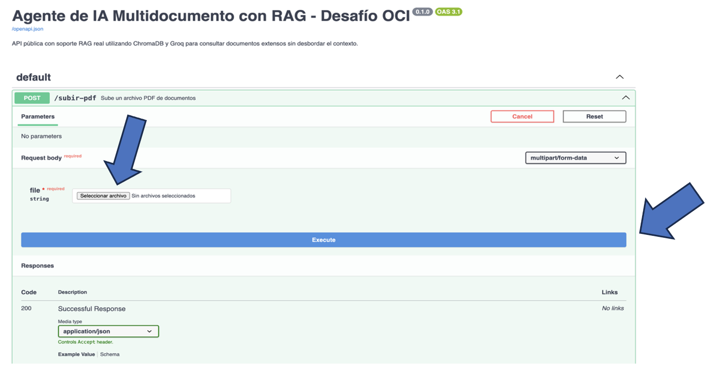
</p>

Una vez subido nuestro archvio pdf y haciendo clic a el boton **Execute**, cambiará otra vez ligeramente la interfaz, y puedes observar que manda un mensaje al final, el cual es: El nombre del archivo pdf que subiste y encuantos fragmentos partio la información para subirla a nuestra base vectorial que se usará para que el agente te de una respuesta a tú pregunta lo más acertada posible.

<p align="center">
    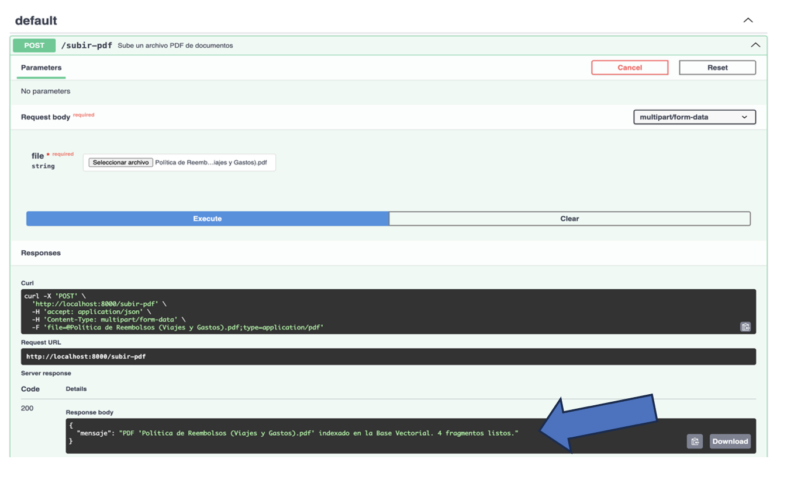
</p>

## ¡En este punto estamos listo para pasarnos al POST preguntar!

<p align="center">
    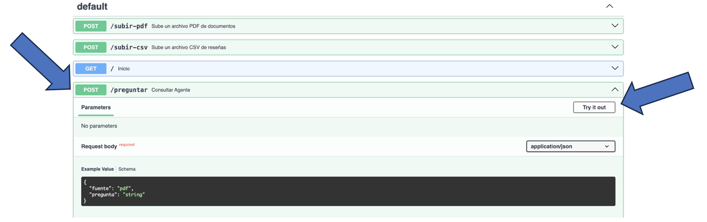
</p>

Una vez haciendo clic a el boton de **Try It out**; Puedes observar otro cambio en la interfaz; Perimitiendote cambiar la pregunta de **hola** que se colocó anteriormente, por lo que tú quieras o lo que sea que le quieras preguntar al agente, o preguntas referentes al contenido de tú archivo y posteriormente le das clic al boton que dice **Execute**.

<p align="center">
    
</p>

Notarás que; La pregunta que se hizo **(hola)** y la fuente usada **(archivo pdf)** son las que se usarán para que el modelo de te una respuesta; Más abajo hay otro recuadro que muestra la respuesta y los fragmetos o contexto que uso el agente del archivo pdf para poder darte una respuesta lo más precisa posible.

<p align="center">
    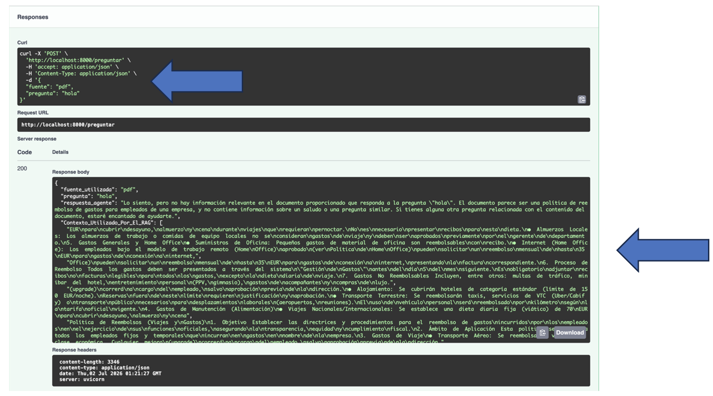
</p>

Para realizar otra pregunta, regresas al **POST preguntar** y cambias la pregunta por otra que desees hacer, y posteriormente le das clic al **boton Execute**.

<p align="center">
    
</p>

Nuestro agente te dará otra respuesta, lo más acertdo posible.

<p align="center">
    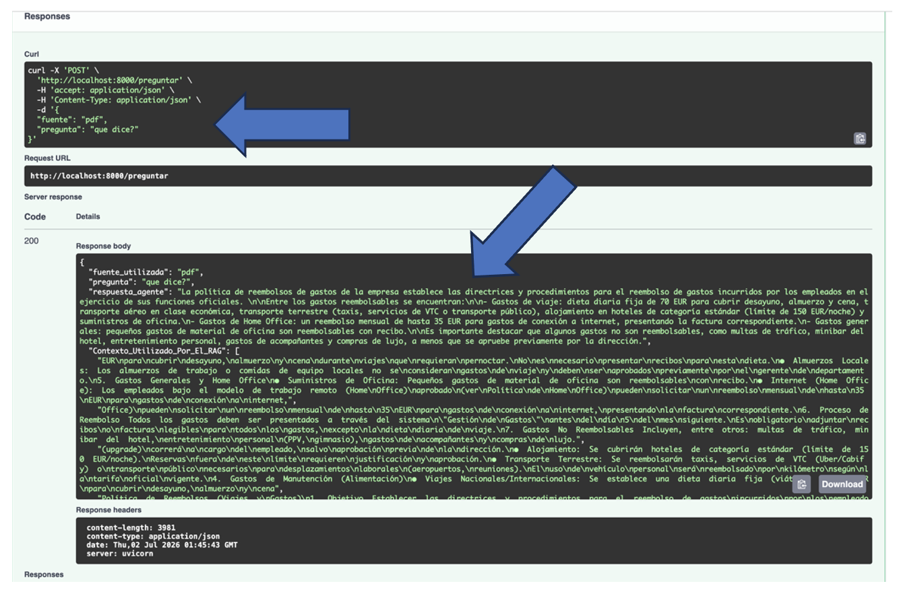
</p>

## Saliendo de la interfaz 

Para salir de la interfaz de Fastapi, en la página web abierta solo la cerramos como cualquier otra página. Y en nuestra terminal, **das clip en la terminal** y colocas el siguiente comando **ctrl + C** para que ejecute la finalización del proceso abierto en la terminal, y deberá salirte algo parecido como se muestra en la imagen:

<p align="center">
    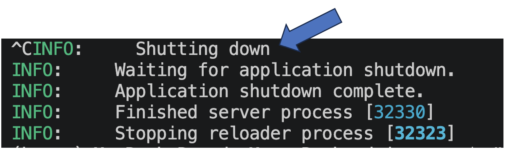
</p>

### Probando ahora con el archivo CSV:

Para probar el archivo csv y preguntar, se realiza el mismo procedimiento como lo realizamos anteriormente pero en sus respectivos POST:
- POST /subir - csv
- POST / preguntar

para ver los resultados que se obtuvieron anteriormente.

# Evidencias para Ejecutar el Backend y Frontend juntos ( Fastapi y Streamlit):

Es tiempo de ver ejecutado nuestro proyecto graficamente bonito, anterior mente usabamos sólo la libreria de Fastapi el cual nos ayudaba de manera inmediata
con la creacion de la interfaz que se mostro a continuación. Ahora queremos tener control de la interfaz grafica para que se vea a lo que estamos más acostumbrados.

- Paso 1. Vas a abrir ***Dos terminales diferentes*** para correr ambos servidores al mismo tiempo (Fastapi y Streamlit), Se muestran imagenes ilustrativas:

***Terminal 1 (Backend - FastAPI)***

<p align="center">
    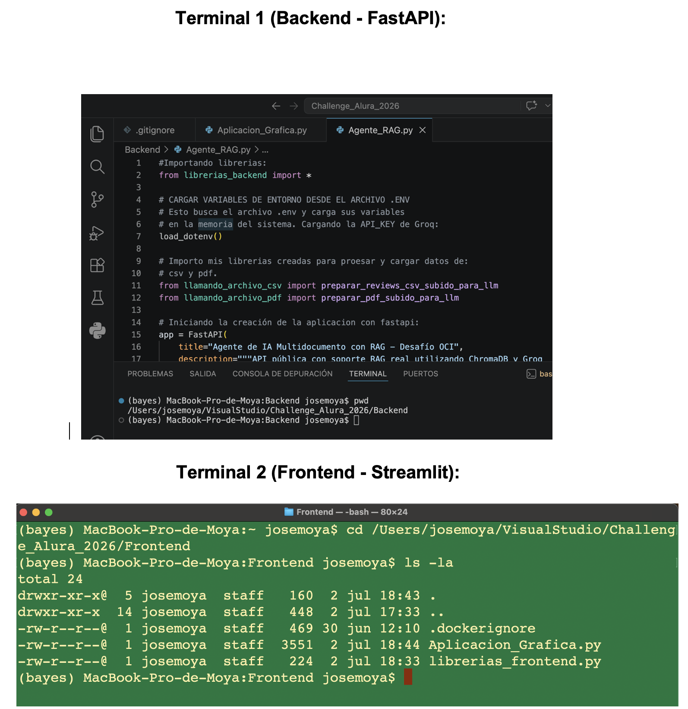
</p>

***Terminal 2 (Frontend - Streamlit)***

<p align="center">
    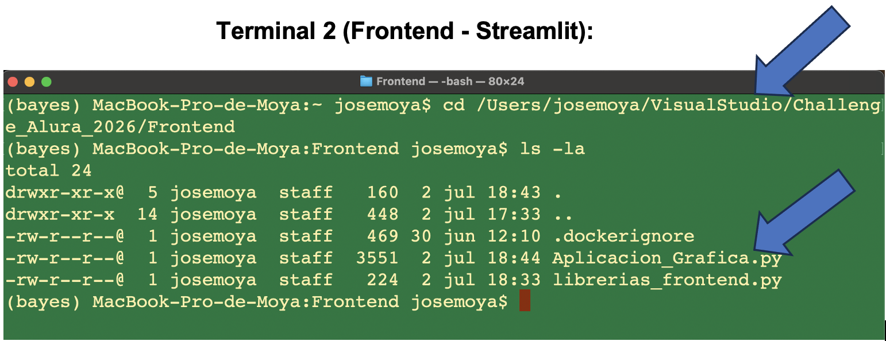
</p>

Recuerda estar en la dirección correspondiente donde esta tú archivo backend ( Terminal 1), así como la dirección correcta en tú Fronted (Terminal 2), 

-	En a terminal 1 pon este comando:
  
      **uvicorn “Nombre_de_Tú_Proyecto_Backend”:app --reload**; En mi caso el nombre de mi proyecto backend se llama: **Agente_RAG.py**
      y colocare ese nombre ***sin su extensión*** (.py). En este caso quedará así y será el comando a ejecutar en la terminal:

      ***uvicorn Agente_RAG:app --reload***

-	En la termina 2 pon este comando:

      **streamlit run “nombre_de_tú_aplicación_Frontend”**; En mi caso el nombre de mi aplicación Frontend es: **Aplicación_Grafica.py**,
 	   En este caso el comando a ejecutar queda así:

      ***streamlit run Aplicación_Grafica.py***


***NOTA:*** Ejecutamos primero el comando en la terminal 1 (uvicorn Agente_RAG:app --reload)
y si todo sale bien, nos deberá mostrar este mensaje en la terminal: **Applicaction Startup complete**, 
que indica que podemos ejecutar sin problema el segundo comando en nuestra terminal 2:

<p align="center">
    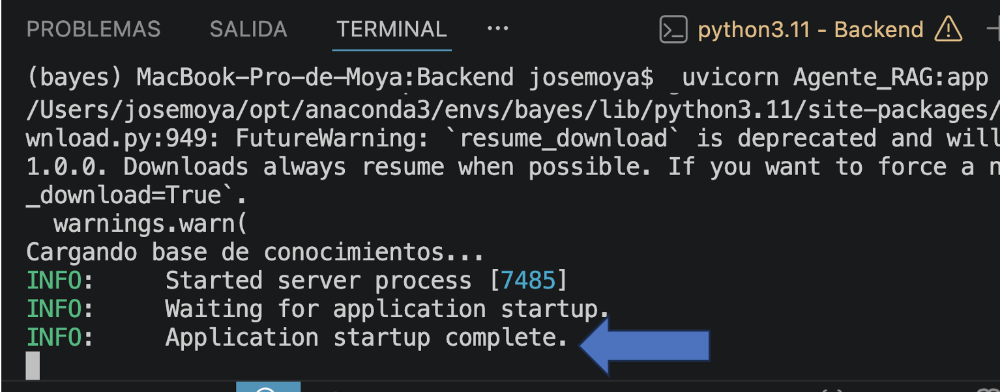
</p>

Ahora en la terminal 2, ejecutamos el comando:

***streamlit run Aplicación_Grafica.py*** 

Y si todo sale bien nos mandará este mensaje en la terminal y abrirá en automatico una venta en nuestro navegador.

<p align="center">
    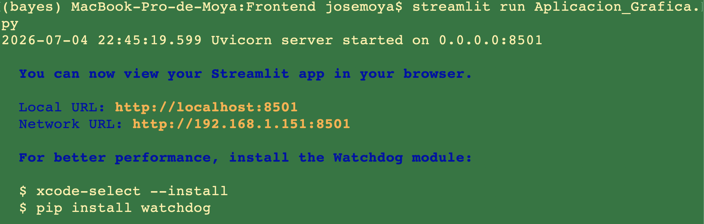
</p>

# Después de haber ejecutado con éxito los comandos en la terminal 1 y terminal 2 
En nuestro navegador saldrá esta interfaz:

<p align="center">
    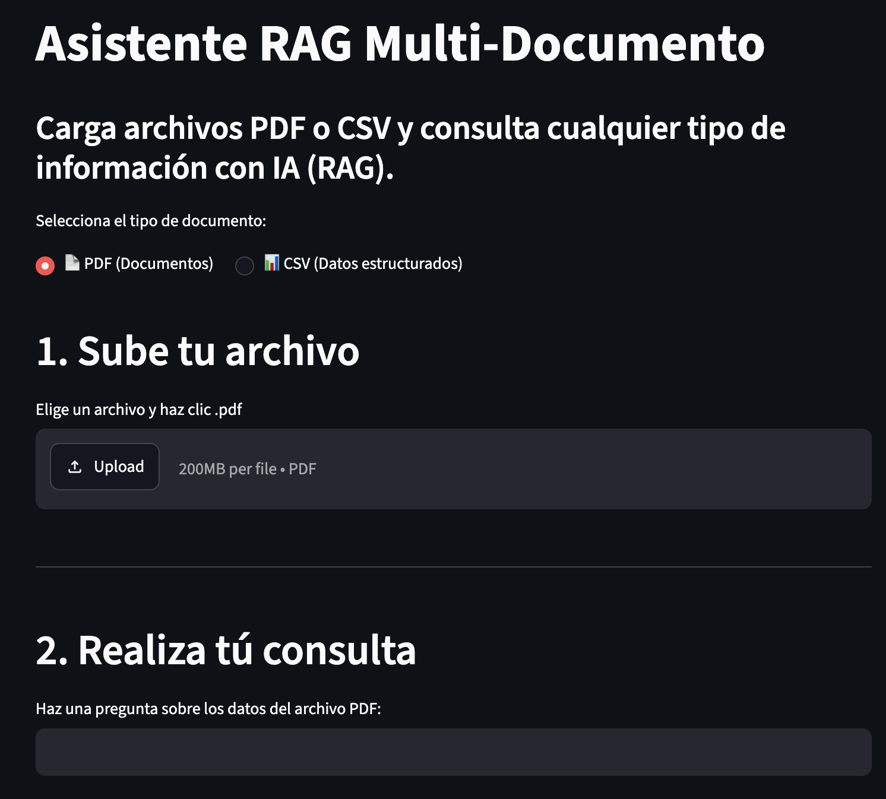
</p>

Y por fin se muestra la interfaz que usaremos para preguntarle cosas a nuestro agente.

# Subiendo archivos y preguntando a nuestra IA:

Se mostrará un icono rojo el archivo a subir y al darle clic en el boton de procesar .PDF en Base Vectorial,
nos mandará un mensaje que se a indexado a la Base con éxito:

<p align="center">
    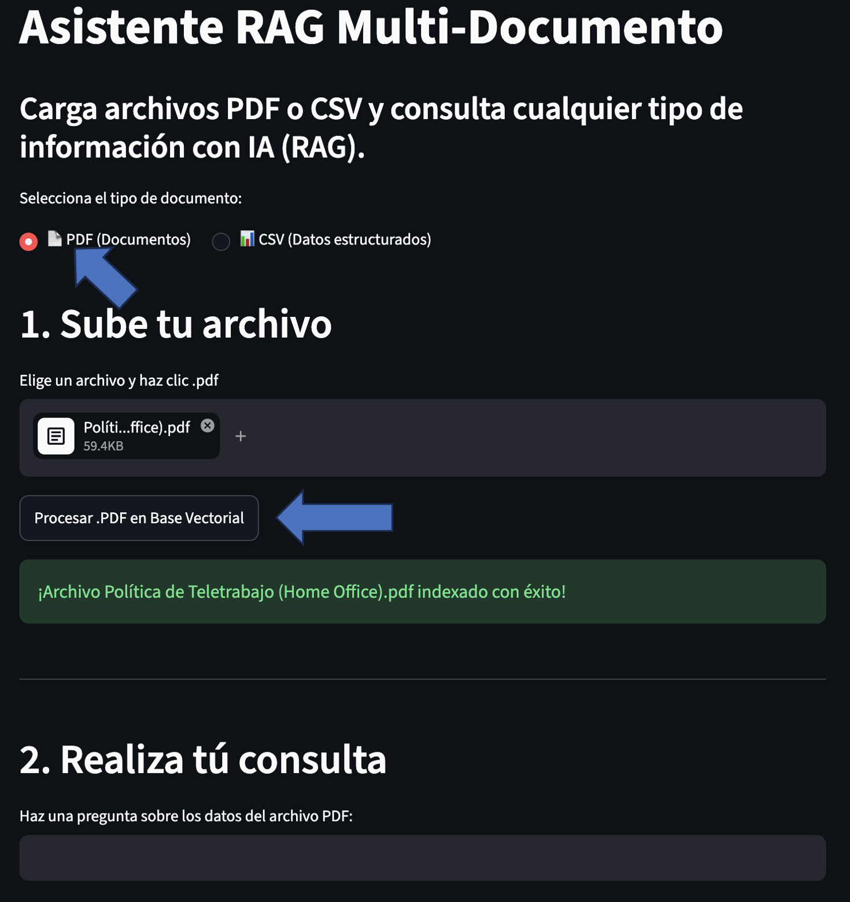
</p>

- Ahora podemos realizar preguntas a nuestro agente:
  En la imagen se puede apreciar que se le hace una pregunta al agente (**De que trata?**), ***una pregunta sin mucho contexto***,
  hacemos clic donde dice **Enviar pregunta a la IA**,
  Después podemos ver que el agente nos da una respusta sobre de que trata el archivo subido;
  Despues vemos una **pestaña** que al haciendo clic ahí podemos ver los **fragmentos**
  usados del pdf subido para que nos den una respuesta a la pregunta hecha.

  <p align="center">
    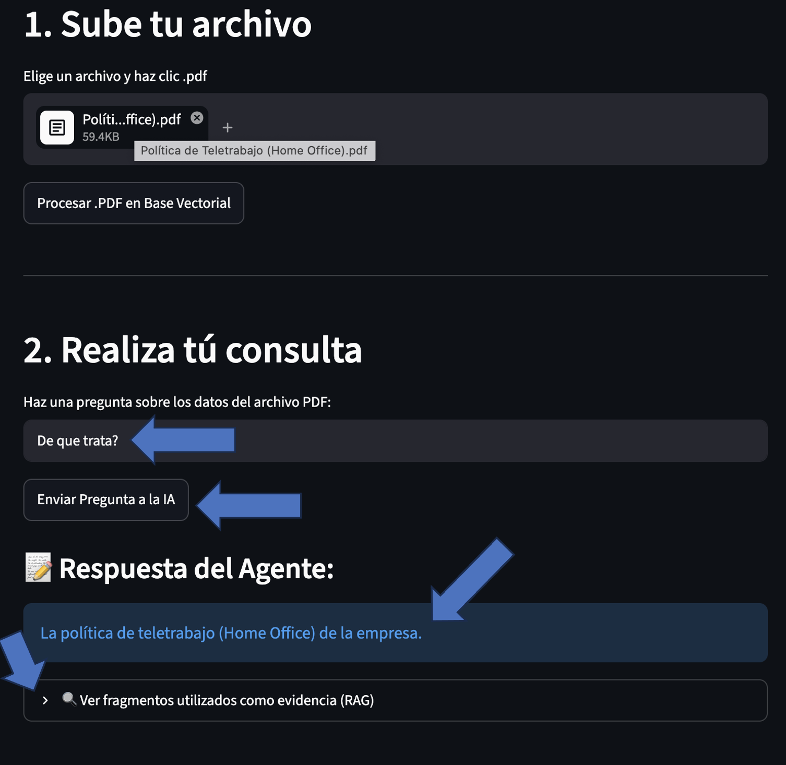
  </p>


- Aquí, podemos apreciar los Fragmentos que uso la IA para darnos contexto (lo más cercano posible) a nuestra pregunta:

   <p align="center">
    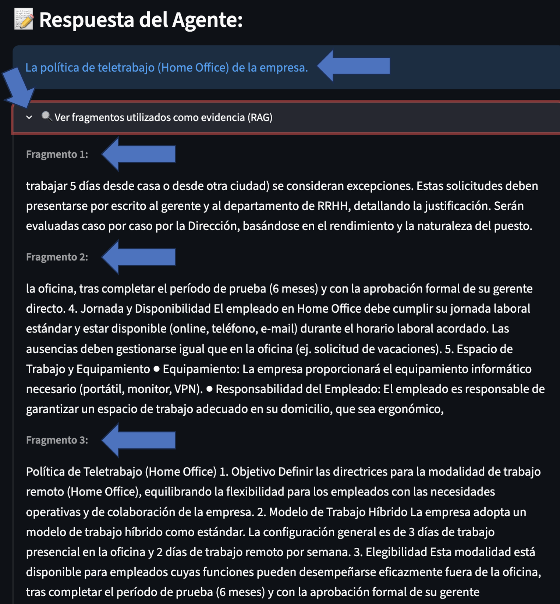
   </p>

Para subir un archivo csv y hacer preguntas, es la misma dinamica que hicimos con subir un archivo pdf así como hacerle preguntas a nuestra IA.

# Ahora nos pasamos a Docker!

Ahora vamos con docker:

-	Primero para hacer pruebas en local, y todo funcione bien. Descargamos docker desktop de este enlace:

 	                     https://www.docker.com/products/docker-desktop/ 

  <p align="center">
    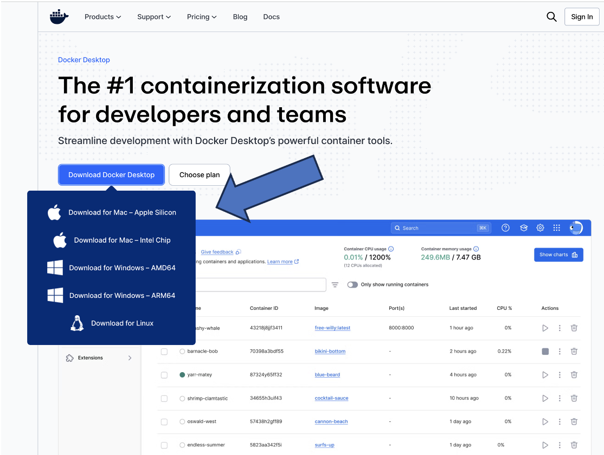
   </p>

Una ves descargado en el sistema operativo de tú preferencia, abres el programa docker Desktop,
verás que no tienes ningun contenedor (containers) aún, esos son los que vamos a crear. 
Y del lado derecho hay un icono de forma de engrane, en esa sección puedes modificar varios parametros ha usar para crear tus contenedores.

<p align="center">
    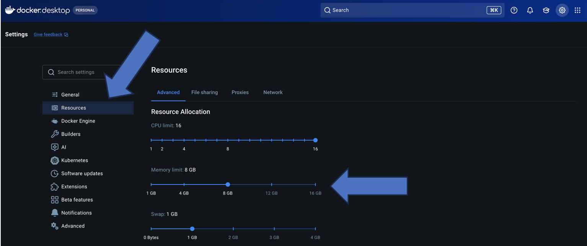
   </p>

En el area de recursos (**Resources**) puedes modificar:
- La memoria ram.
- La memoria swap.
- El espacio de disco duro a emplear, entre otras cosas que tú desees modificar.

   <p align="center">
    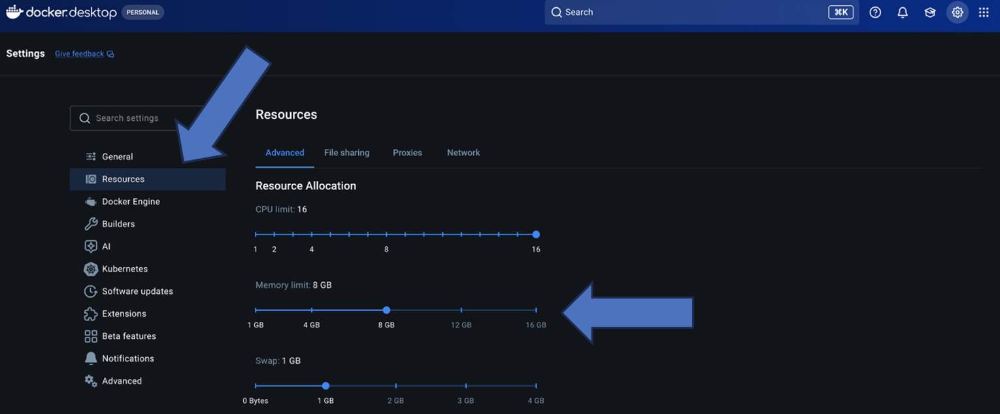
   </p>

# Ahora nos pasamos a la creación de nuestros archivos docker

En los cuales tedremos los recursos necesarios que nos servirán para que funcione en cualquier computadora que deseemos.

Ya que estos archivos contendrán:

-	Archivos que contiene nuestro proyecto tanto de backend como frontend.
-	Se creará un archivo dockerfile , sin extensión el cual tendrá una serie de pasos para su intalación.
-	Librerias usadas en nuestro proyecto.
-	Se creará otro archivo llamado dockerignore, igual sin ninguna extensión para no subir variables de entorno entre demás cosas que no debemos compartir por seguridad.
-	
## Archivo DockerFile:

Contiene las instrucciones secuenciales para empaquetar tú aplicación. A continuación, pongo una serie de pasos para crearlo, 
construir tú imagen y ponerla a funcionar:

1. Preparar tu proyectoCrea una carpeta en tú computadora que contenga los archivos de tu código o aplicación (por ejemplo, tus scripts de Python).
2. Crear el archivo Dockerfile dentro de esa misma carpeta, crea un archivo de texto y asígnale exactamente el nombre Dockerfile (sin ninguna extensión como .txt o .doc).
3. Escribir las instrucciones básicas, abre el Dockerfile con cualquier editor de código o notas e ingresa la siguiente estructura esencial:

***Dockerfile***

- PASO 1: Define la imagen base desde Docker Hub (ej. Node, Python, Ubuntu)
          FROM

- PASO 2: Crea y define el directorio de trabajo dentro del contenedor
          WORKDIR /app

- PASO 3: Copia los archivos de configuración de dependencias primero (mejora la caché)
          COPY package*.

- PASO 4: Ejecuta comandos para instalar tus librerías o dependencias
          RUN pip install

- PASO 5: Copia el resto de los archivos de tu proyecto al contenedor
          COPY . .

- PASO 6: Indica el puerto que usará tu contenedor (opcional)
          EXPOSE 3000

- PASO 7: Define el comando que arrancará tu aplicación al iniciar el contenedor
          CMD [ ]

El archivo DockerFile quedará como se muestra a continuación:

 <p align="center">
    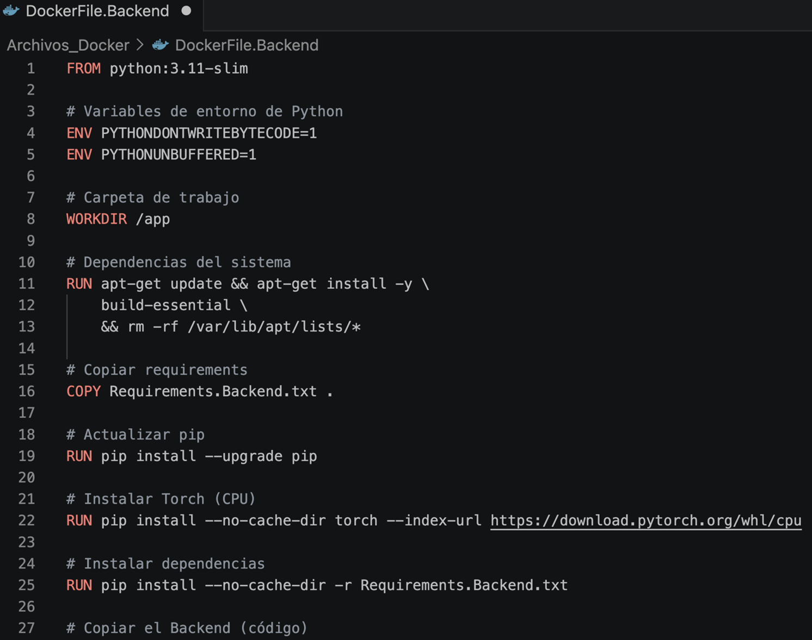
   </p>
   
Mientras nuestro archivo dockerignore tiene dentro los archivos pesados o locales que no quieres que se suban al contenedor,
como node_modules/, .git/ o archivos de configuración locales, API_keys, por mencionar algunos. Se muestra una imagen ilustratia:

 <p align="center">
    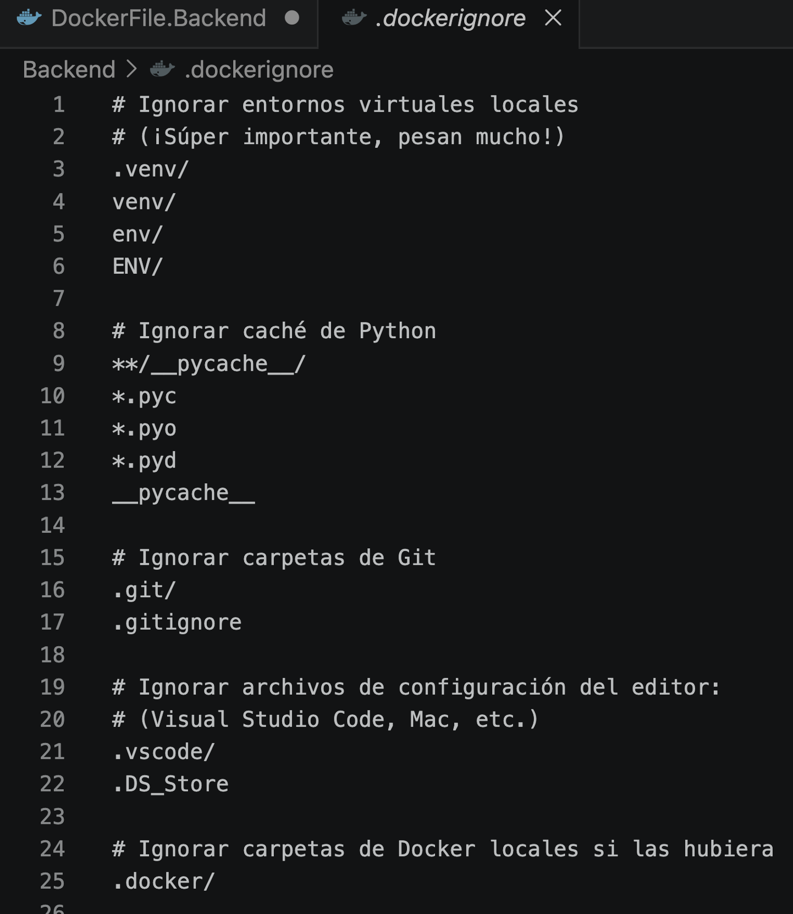
   </p>

Ambos archivos se encuentran en el repositorio y puedes ver a detalle las cosas que se ocupan en el docker file
tanto como las cosas que no se permitieron subir en el dockerignore.

Tambien creamos otro archivo llamdo ***Requirements.Banckend.txt*** y ***Requirements.Frontend.txt***,
aquí se encuentran todas las librerias usadas especificas:

<p align="center">
    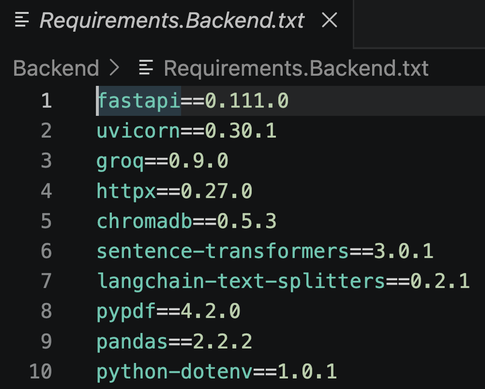
   </p>

***Nota:*** Observa que especificamos versiones para cada una, que son las que se usaron para que nuestro proyecto funcione.

Y finalmente viene el docker-compose.yml, el cual es el que ejecuta todo para la creación de nuestas imágenes en docker desktop y las usemos sin problema alguno.

<p align="center">
    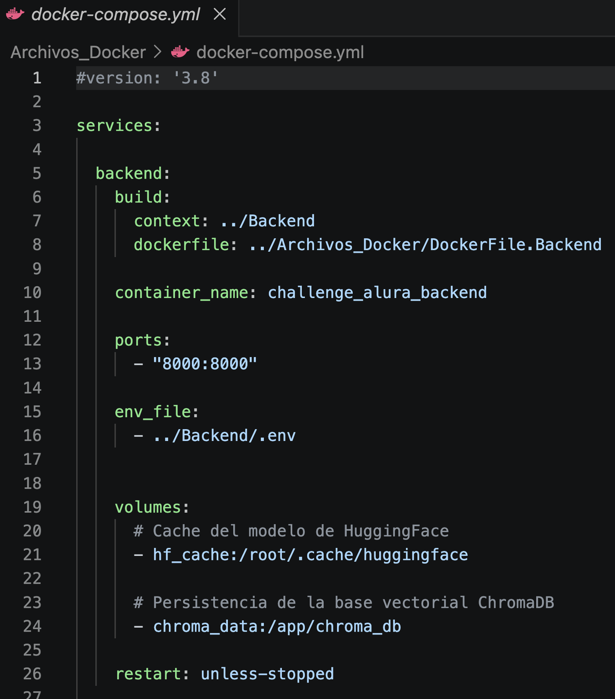
   </p>

Cada archivo esta en el repositorio donde podrás ver que requiere cada parte; ***Nota***: 
Si ordenas tú proyecto de otra forma. Revisa que estes en las rutas correctas.

Para ejecutar la creacion de las imágenes docker, Debe estar abierto el programa Docker desktop.
y nuestro entorno de trabajo, en el cual debemos estar en la ruta donde se encuentra nuestro archivo:

-	docker-compose.yml

<p align="center">
    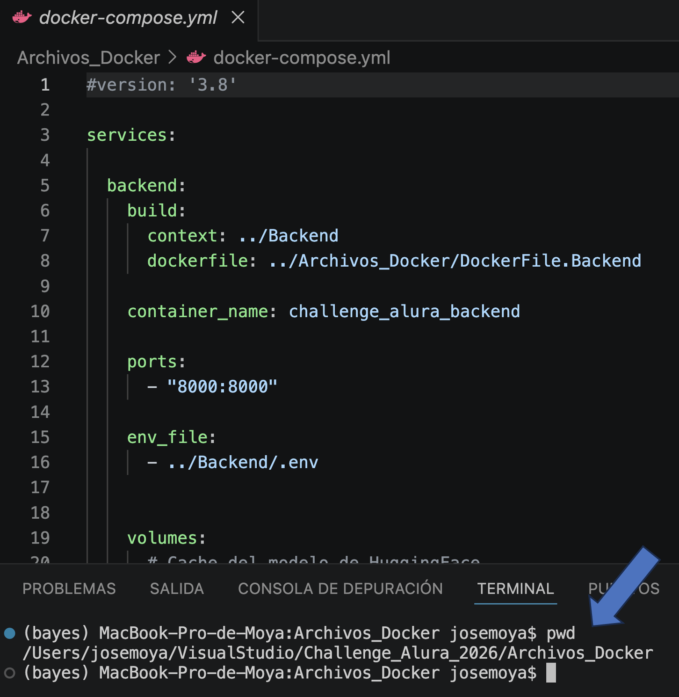
   </p>

Es importante que nos encontremos en esa ruta ya que el comando a ejcutar después es:

-	docker compose up --build
  
y si no nos encontramos en la ruta correcta, nos marcar error,
***Nota:*** 

- También es importante que el programa docker desktop ya este abierto.

<p align="center">
    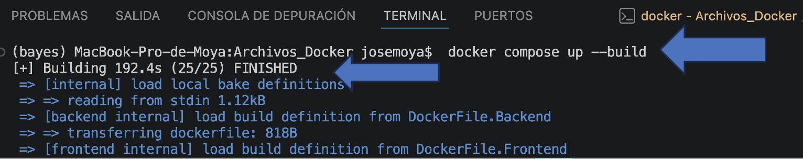
   </p>

Si todo sale bien, mostra este mensaje de:

-	Building 192.4s (25/25) FINISHED

***Recuerda!:*** 
Que el tiempo de construcción depende de tú internet, ya que descarga todas las librerias que necesita para funcionar,
así que ese tiempo puede variar. 

En la terminal verás en color verde que se creo todo lo necesario de manera correcta para que funcione en nuestro docker desktop: 

<p align="center">
    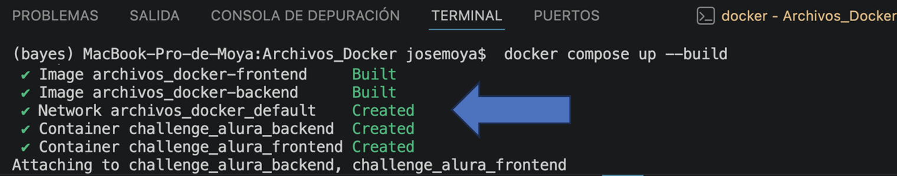
   </p>

En nuestro pograma de docker desktop veremos nuestros contenedores creados, 
y haciendo clic en la columna port, donde se encuntra nuestro frontend; Veremos nuestra interfaz funcionando:

<p align="center">
    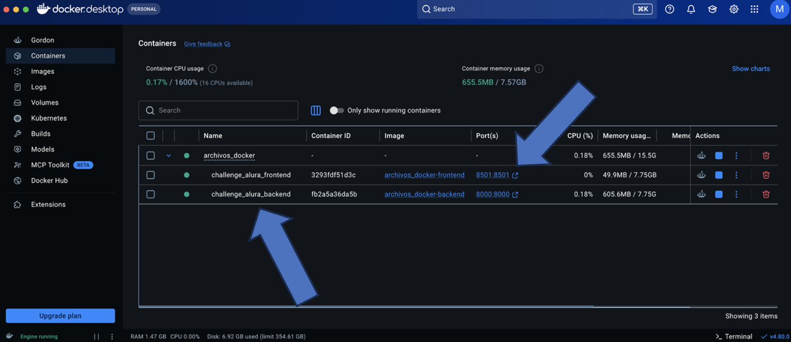
   </p>

Después de hacer clic en:

- ***La columna port 8501:8501***

Se despligará nuestra interfaz funcionando:

<p align="center">
    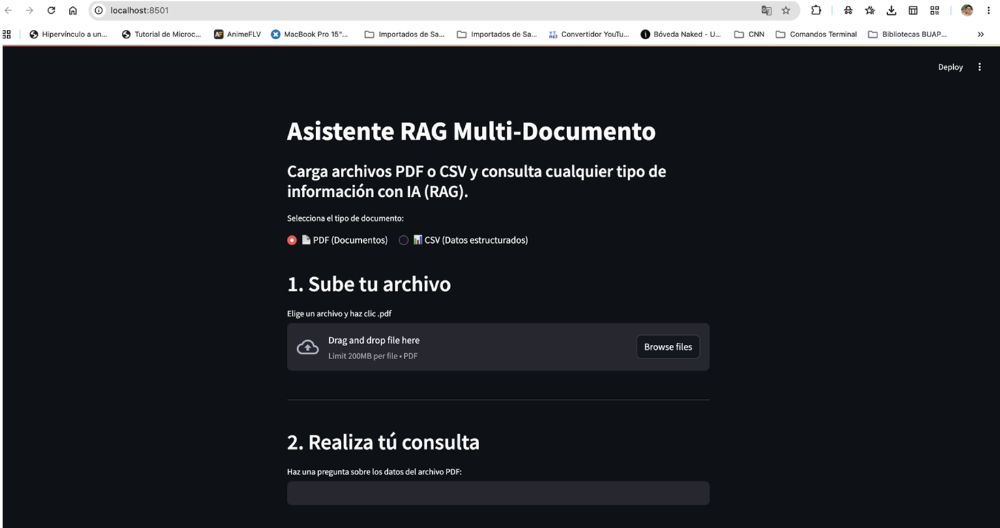
   </p>

La tematica de subir archivos y realizar preguntas a nuestra IA es la misma que ya se explico anteriormente.

- Con estas pruebas estamos listos para subirlo a la nube.


---

## 4. Pruebas en la Nube!

Despues de intentarlo varias veces, no se pudo crear una cuenta gratuita en oracle,
Así que para desplegar nuestro proyecto recurrimos a otra estancia.


<p align="center">
    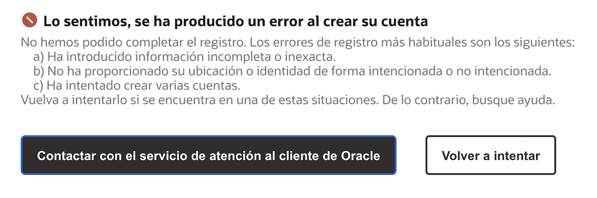
   </p>

Usamos Render para desplegar nuestro proyecto en la Nube:

   <p align="center">
    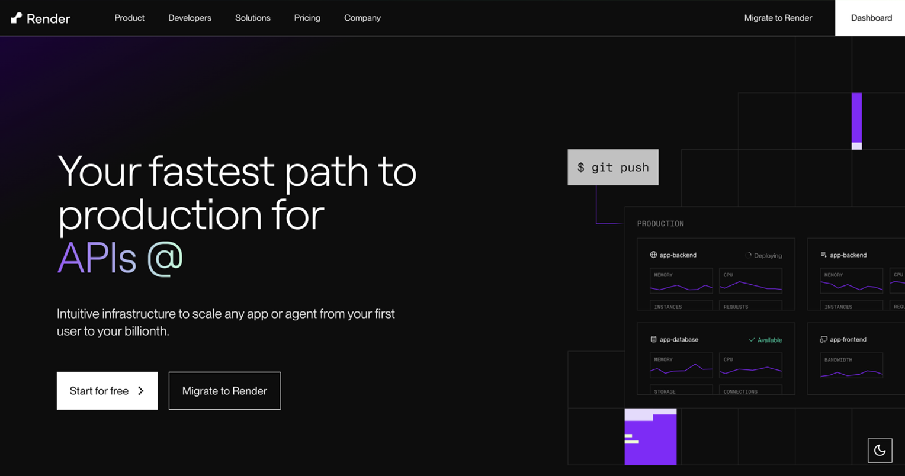
   </p>

Ventajas:

- Despliegue directo desde GitHub.
- Soporta Docker.
- Muy fácil de configurar.
- Certificado HTTPS automático.
- Tiene plan gratuito. 

Desventajas:

- El servicio entra en suspensión cuando no recibe tráfico durante un tiempo.
- El almacenamiento del plan gratuito no es permanente, por lo que la base ChromaDB se perdería al reiniciar el servicio si no usas un volumen de pago. 
- Ideal para mostrar un portafolio o un proyecto escolar.

Como ya tenemos:

- Docker funcionando.
- GitHub listo.
- Archivos docker.
- Backend y Frontend separados. 

Escogimos Render, ya que es el camino con menos dificultad para 
publicar el proyecto y poderlo compartirlo mediante una URL.

Más adelante, cuando necesitemos almacenamiento persistente, 
más recursos o mayor disponibilidad, se puede migrar a OCI, AWS o Azure con cambios mínimos.

En Render crearemos:

- Un Web Service para el Backend (FastAPI).
- Un Web Service para el Frontend (Streamlit). 

***Nota:*** El frontend llamará al backend mediante una URL pública.


## Creamos una cuenta en Render:

Entramos a la página oficial de Render ( https://render.com/ ) y creamos una cuenta usando GitHub.
Eso permitirá que Render acceda a tus repositorios para desplegarlos automáticamente.

Una vez creado nuestro usuario en la pagina de Render; Le das clic en la pestaña de ***+New***, 
y saldra otra pestaña con los servicios que puedes crear, dale clic en ***New Web Service***, como se muestra a continuación:

   <p align="center">
    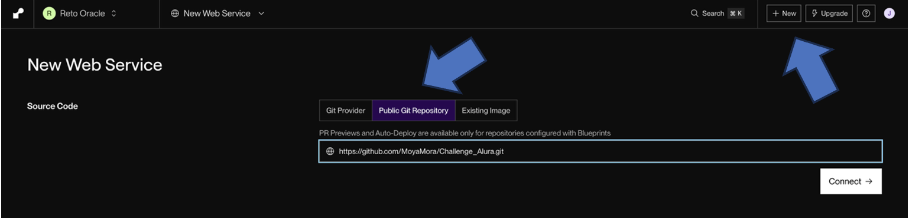
   </p>

Puedes conectarlo con el repositorio público que desees, posteriormente le das clic en el boton ***Connect***.

Y ahora saldrá esta pantalla donde configuras la instalación de tus archivos docker:

   <p align="center">
    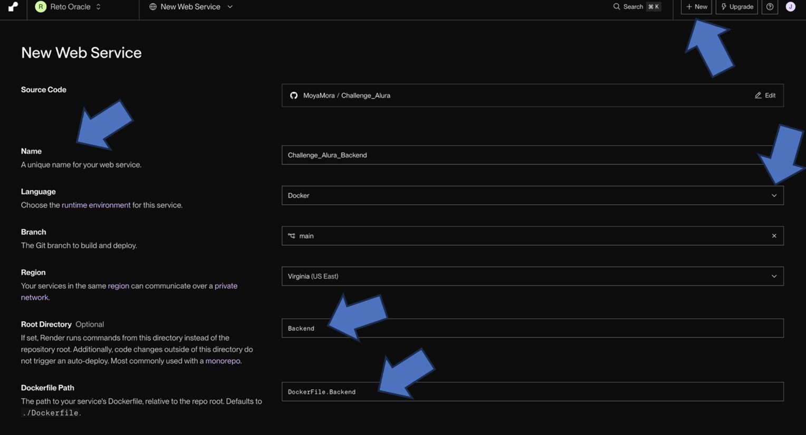
   </p>

***Observa***, que en esta parte se configura:

- Nombre de tú servicio web.
- Ambiente de trabajo, en este caso Imágenes Docker.
- Ruta de trabajo ( Carpeta donde guardas tus archivos Backend)
- Y por ultimo tú ruta donde esta tú archivo DockerFile.Backend

Una vez configures eso, te pedira que plan deseas usar, en este caso escogimos gratis,
***Observa*** que los recursos que dan de forma gratuita son muy limitados:

   <p align="center">
    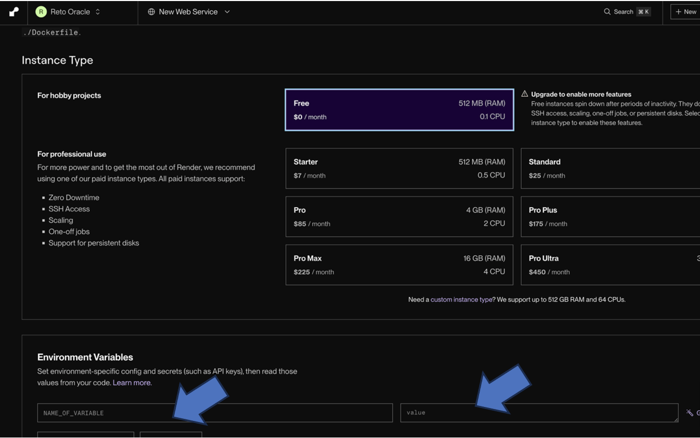
   </p>


En las casillas marcadas con la flecha azul colocas el nombre de tus variables de entorno para tú backend,
en mi caso la casilla de mombre de variables:

- Se nombro: API_KEY_GROK 
- Y en la casilla valor: gzk_******** (sin comillas),

después abajo se encuentra un botón que dice ***Deploy Web Service***, le das clic y empieza a instalar todo.

Una vez que instale todo te saldra un recuadro verde que dice ***Live***; 
Indicando que ya se levanto tú direccion URL para tú backend y 
más abajo indicado con la flecha azul te muestra la página que puedes usar para ver la ***interfaz de Fastapi***
y puedes hacer las mismas pruebas que ya hicimos antes con cada uno de los endpoints:

   <p align="center">
    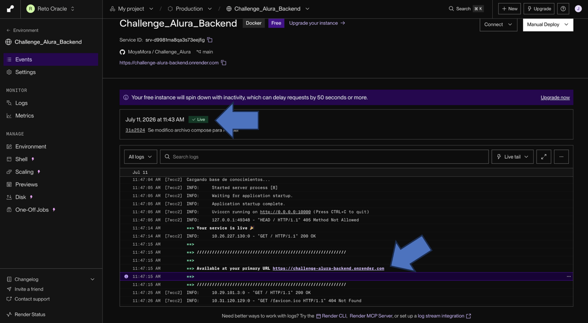
   </p>

## Procedemos a configurar el Fronted (Streamlit)

Los pasos son muy similares a los que hicismos anteriormente; Ahora para nuestro frontend,
colocamos la capeta y ruta correspondiente donde se encuentran nuestros archivos fronted
para realizar su instalación, como se aprecia en la siguiente imagen:

   <p align="center">
    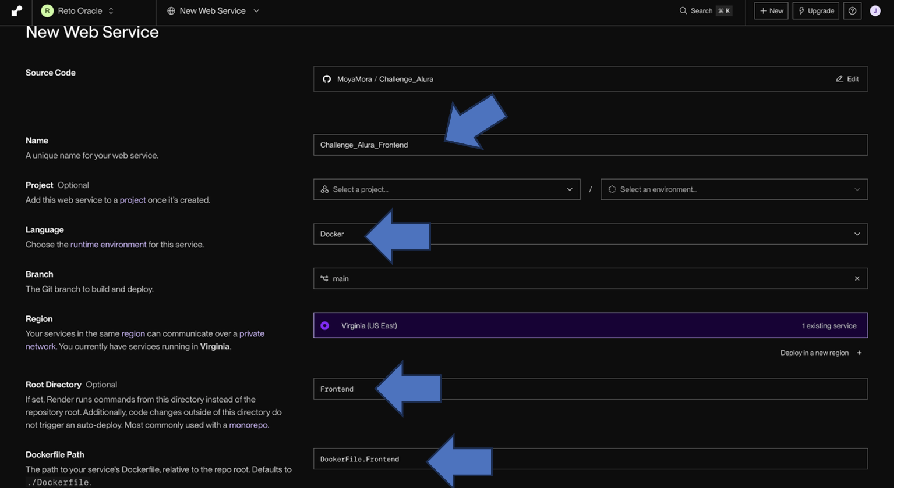
   </p>


Ahora configuramos nuestras variables de entorno:

***Observa:*** que en la casilla de **Name_of _variable**:

- Corresponde a el nombre de tú API_URL que le hayas dado.
- En la casilla de **value**, en este caso va la direción de la ruta que nos creo en backend.

después procedemos darle clic al botón, **Deploy Web Service** para que inicie su instalación.

   <p align="center">
    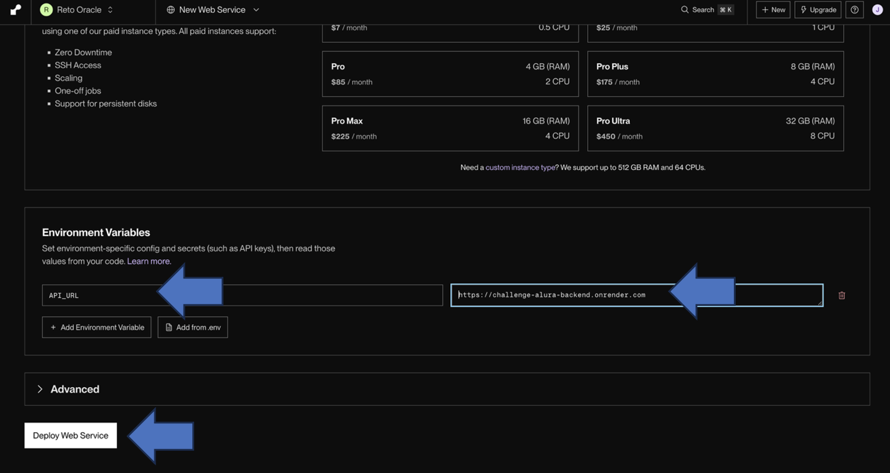
   </p>

Una vez se haya instalado todo; De igual forma nos saldrá el recuadro verde que dice ***Live***,
y la direción URL que podremos ***compartir con quien sea*** para que use nuestra API, en cualquier parte del mundo.
Nuestra interaz se ve así:

   <p align="center">
    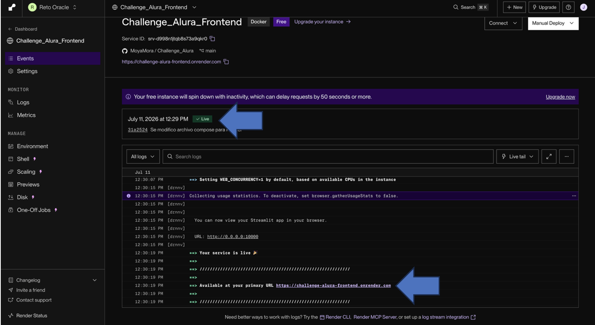
   </p>

Las flechas de color azul, nos indican los botones que podemos usar para interactuar con nuestra API,
Y en este caso subimos un archivo csv para usarla; Se muestra a continuación imagen representativa:

   <p align="center">
    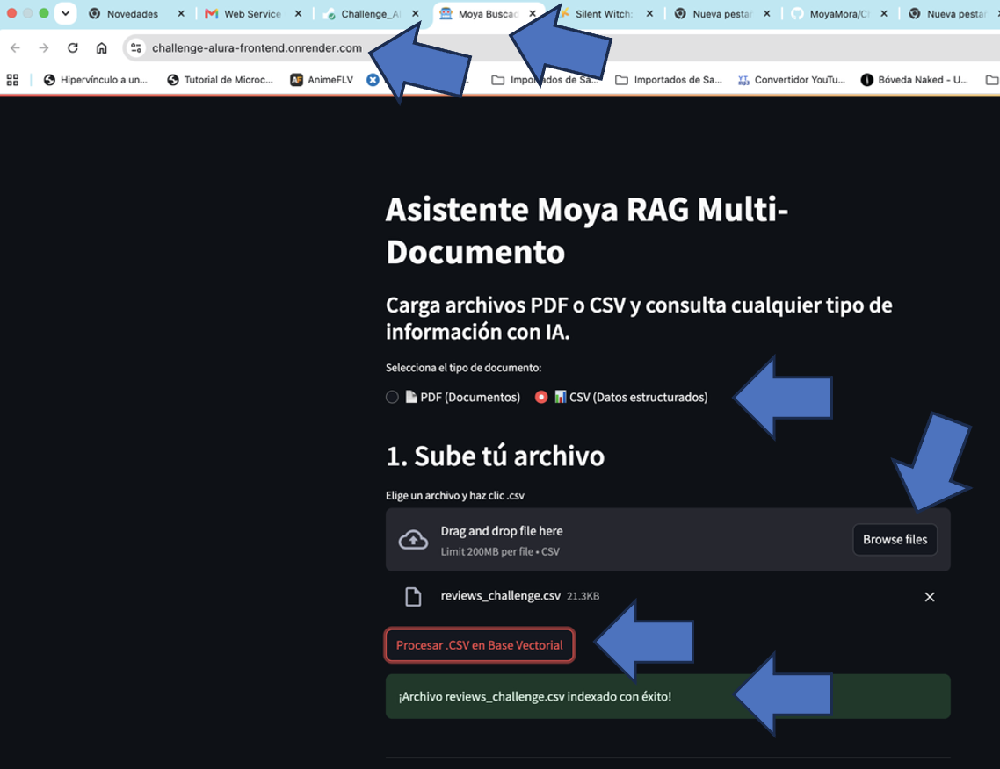
   </p>

Una vez subido nuestro archivo escogido, procedemos a hacer una pregunta no tan directa a nuestro agente,
y nos brinda una respuesta lo más acertivo a lo que le preguntamos:

   <p align="center">
    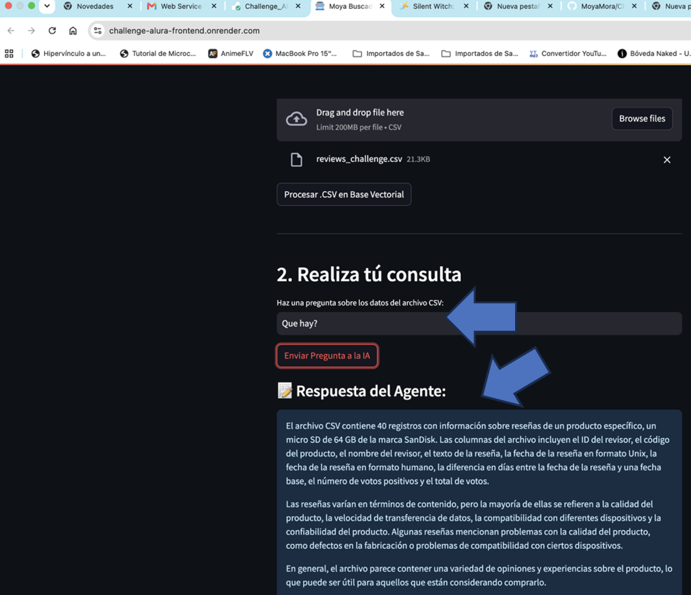
   </p>

y podemos apreciar los fragmentos empleados del documento que se le dio a nuestro modelo de IA para dicernir que contestar.
Se muestra imagen ilustrativa:

<p align="center">
    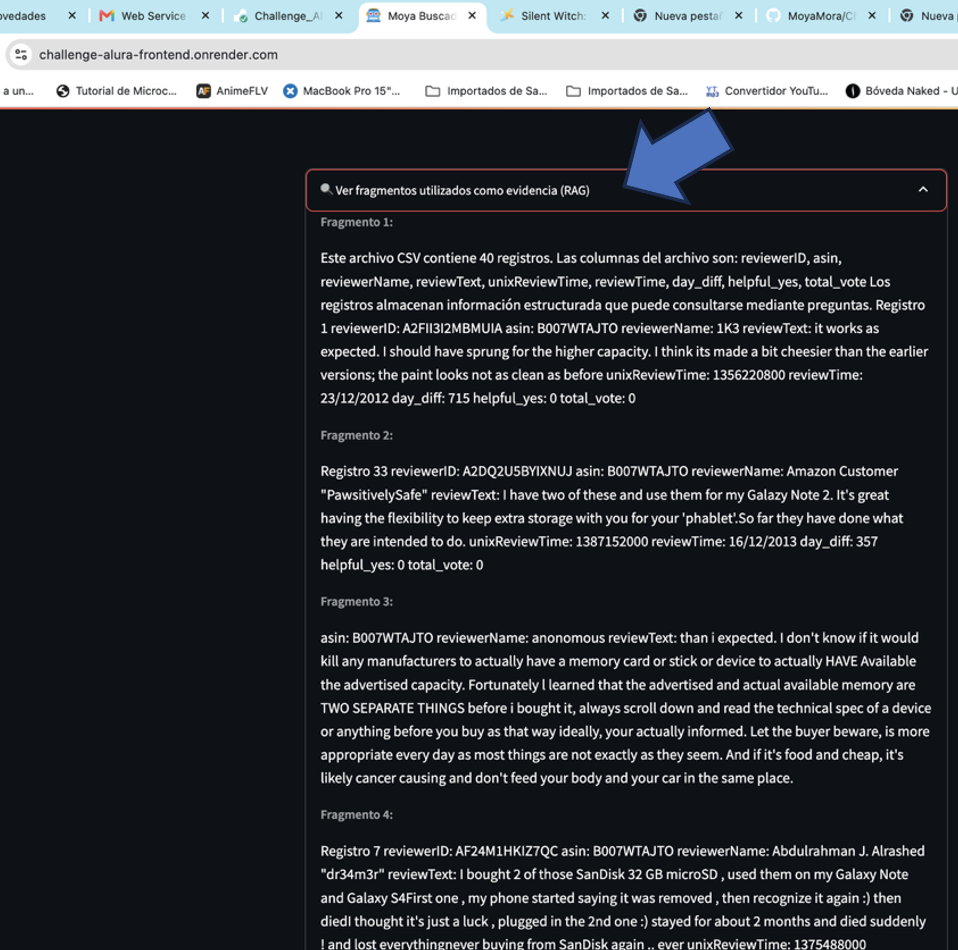
</p>


# Nota importante:

Recuerda que; ***Los recursos en Render son muy limitados***, usa por favor los archivos que 
se encuentran en la carpeta ***Documentos_de_prueba*** en este repositorio o usa documentos no tan pesados, ya que cuando subas algun archivo y pase a:
***Procesando y generando vectores locales*** puede tardar un poco, ***NO te desesperes***. Cuando termine manda un mensaje diciendo: ***¡Archivo "Nombre del archivo subido" indexado con éxito!***, ya que los recursos gratuitos de Render son:


                                                |     RAM    |   CPU   |
                                                |------------|---------|
                                                |   512 MB   |   0.1 % |


Como puedes observar es muy limitado los recursos gratiuitos dados por Render.
Obviamente en local funcionaba todo muy fluido ya que los recursos eran otros, como por ejemplo una memoria RAM de 16 GB.
Que actualmente las computadoras tienen igual o superior recursos, si deseas usarlo de manera local funcionará muy fluido, esto debido 
a los recursos que ofrezca tú computadora;
O si dispones de otro lugar donde desplegar el proyecto con mayores recuros como OCI, AWS, funcioanra más rapido por los recursos brindados
por esas instituciones.

En el caso de desplegarlo en Render, La RAM es la memoria temporal que usa el programa mientras está funcionando.
En esos 512 MB que nos da Render tienen que caber, al mismo tiempo:

- FastAPI.
- ChromaDB.
- El modelo de embeddings (SentenceTransformer).
- Pandas.
- Los archivos CSV o PDF que suban los usuarios.
- Las consultas a Groq.
- Python y todas las librerías.

Yo tuve problemas al insertar los 61 Fragmentos de 10 en 10 de mi archivo CSV. En algún momento el consumo de memoria aumentó demasiado y Render tuvo dificultades. 
Para solucionarlo se redujo el tamaño del lote a 5, disminuyó el pico de memoria y el archivo csv y pdf se puden susbir, procesar y 
posteriormente se puede hacerse uso de la IA para que responda nuestras preguntas.


# Dirección URL para hacer uso del proyecto:

Comparto la dirección de la págian donde funciona gracias a Render:


```
https://challenge-alura-frontend.onrender.com/ 
```

Render apaga o prende el servicio prestado y puede ocurrir que al inicio salga esto en la página:

 <p align="center">
    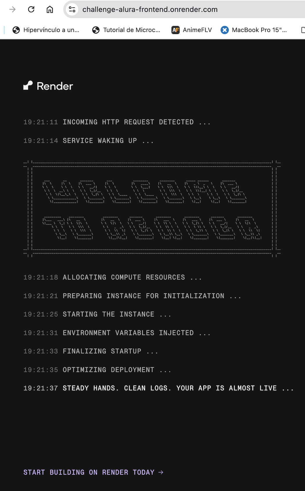
   </p>

# Nota: No te preocupes es normal, render está **reactivando** los servicios de la página gratuita creada; Por favor espera a que cargue bien la página Diseñada, Gracias!.


---


